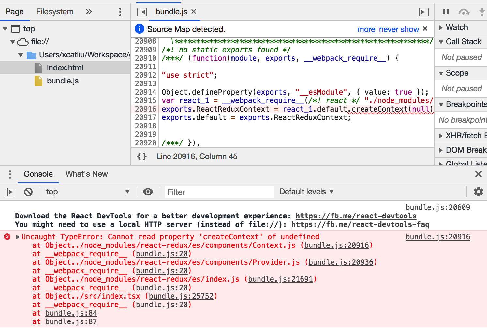

# Report a bug from react-redux

[](https://greenkeeper.io/)

Related issue: https://github.com/reduxjs/react-redux/issues/1230

This project builds a simplest TODO App with:

- react 16.8.6
- react-dom 16.8.6
- react-redux 7.0.1
- redux 4.0.1
- redux-devtools-extension 2.13.8
- redux-thunk 2.3.0
- awesome-typescript-loader 5.2.1
- typescript 3.4.3
- webpack 4.29.6
- webpack-cli 3.3.0

## Getting Started

```bash
npm i
npm start
open public/index.html
```

However, it throws error:



The reason is that we use `awesome-typescript-loader` to compile and bundle both ts files **AND js files**, so the react-redux library in node_modules will be compiled by `awesome-typescript-loader`, which is not compatible with `import React from 'react'`.

One solution is replacing all `import React` to `import * as React` in `node_modules/react-redux/es`.

The other solution is using `react-redux/lib` rather than `react-redux`.

In branch `react-redux/lib` we can run this page without error.
